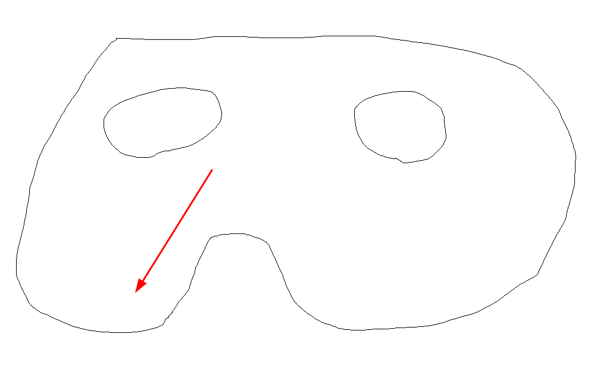

### ЛР6 - РЕАЛИЗАЦИЯ И ИССЛЕДОВАНИЕ АЛГОРИТМОВ ЗАТРАВОЧНОГО ЗАПОЛНЕНИЯ СПЛОШНЫХ ОБЛАСТЕЙ

### Теорвопросы

1. Рисует всегда хрень вот такого рода (отверстие может быть одно или два, но оно будет и будут изгибы снизу)

Затравку ставит там, где стрелочка

2. _Удивляется_, как это алгоритм смог выбраться из "ямы" и заполнить все части фигуры

[Тут вы объясняете ему весь ход работы программы](https://github.com/Mansurow/bmstu-iu7-4sem-CG/wiki/%D0%9A%D0%93-%D0%9B%D0%B5%D0%BA%D1%86%D0%B8%D1%8F-08.-%D0%A0%D0%B0%D1%81%D1%82%D1%80%D0%BE%D0%B2%D0%B0%D1%8F-%D0%B3%D1%80%D0%B0%D1%84%D0%B8%D0%BA%D0%B0.-%D0%90%D0%BB%D0%B3%D0%BE%D1%80%D0%B8%D1%82%D0%BC%D1%8B-%D0%B7%D0%B0%D0%BF%D0%BE%D0%BB%D0%BD%D0%B5%D0%BD%D0%B8%D1%8F-%D1%81-%D0%B7%D0%B0%D1%82%D1%80%D0%B0%D0%B2%D0%BA%D0%BE%D0%B9.#%D0%BF%D1%81%D0%B5%D0%B2%D0%B4%D0%BE%D0%BA%D0%BE%D0%B4-%D0%BF%D0%BE%D1%81%D1%82%D1%80%D0%BE%D1%87%D0%BD%D0%BE%D0%B3%D0%BE-%D0%B0%D0%BB%D0%B3%D0%BE%D1%80%D0%B8%D1%82%D0%BC%D0%B0-%D0%B7%D0%B0%D1%82%D1%80%D0%B0%D0%B2%D0%BA%D0%B8)

3. В процессе ответа на предыдущий вопрос обязательно сказать, что же такое непрерывный интервал пикселей.

Этот вопрос вызывает дискуссии в нашем коллективе. Я придерживаюсь мнения, что это - группа примыкающих друг к другу не закрашенных пикселей. (Ограниченная закрашенными или граничными пикселами)

Некоторые коллеги добавляют к этому определению то, что эти пиксели лежат на одной строке.

По моему, принимается и тот и тот ответ. Я лично не говорил про одну строку, всё зачли.

4. Что такое затравочный пиксель?

Некоторый (произвольно выбранный) пиксель в области, которую нужно заполнить.

5. Какие пиксели в процессе работы алгоритма стоит выбирать в качестве затравочных и почему?

Выбираем самый правый при движении слева-направо и наоборот, потому что рассматриваемый интервал пикселей может прерываться граничными пикселами или уже закрашенными пикселами, т.е рассматриваемый интервал может содержать в своем составе несколько непрерывных интервалов пикселей. Тогда, если брать в качестве затравочного пикселя, первый пиксель по ходу движения, мы можем потерять области, которые нужно закрасить.

6. Какие параметры влияют на скорость работы алгоритма?

Я лично не смог ответить на этот вопрос так, как хочет этого Куров, но коллеги говорят, что ответ -
"Количество непрерывных интервалов"
